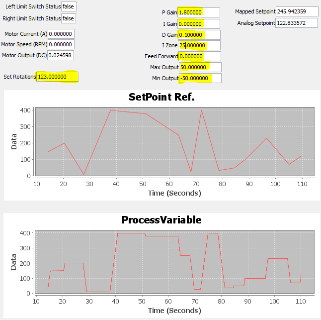
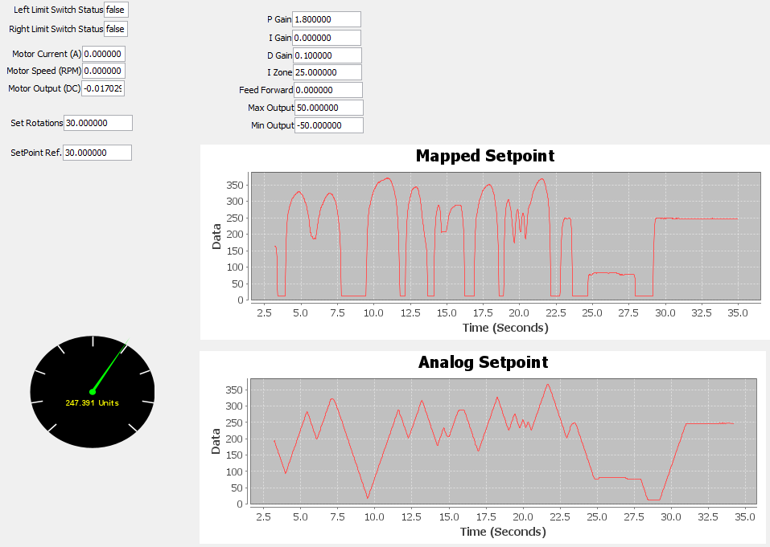

# Position Closed Loop PID Control
  
<figcaption align = "left"><b>Figure 1: Coach Werner's testbench with RoboRio, Sparkmax, potentiometer, and JE-PLG-410.</b></figcaption> 

# Description
This program demonstrates a closed loop PID postion controller that controls the position of a 'shuttle' along a lead screw. The lead screw is driven by a brushed DC motor using a SparkMax motor controller. There are two different modes/options for position control: manual mode, and analog mode. Manual mode requires the user to manually type the `Set Rotations` value. Analog mode uses real-time data from the analog input channel of the RoboRio using a potentiometer. A practical application of this code is to command a motor to a known rotational position and hold it there.

# Usage
Set the variables at the beginning of the example to match your setup.
- `deviceID` - CAN device ID
- `MotorType` - kBrushed or kBrushless
- `SparkMaxRelativeEncoder.Type.kQuadrature` - KQuadrature or kHallSensor
- `countsPerRev` - 4
- `AnalogInput` channel - 0

# Demo

    <video src="https://github.com/NRHartFRC/Position-Closed-Loop-PID-Control/assets/122415724/0ba213d1-b843-48c1-bdec-c1597616914e" type="video/mp4">
    Your browser does not support the video tag.

# Walk Through
## Code Specifications
- M. Werner's testbench setup
- VS Code (w/ WPILib Extensions)
- SmartDashboard 2023 (an application for widgets, vs. Shuffleboard plugin)
- [RoboRio](https://www.andymark.com/products/ni-roborio-2?via=Z2lkOi8vYW5keW1hcmsvV29ya2FyZWE6Ok5hdmlnYXRpb246OlNlYXJjaFJlc3VsdHMvJTdCJTIycSUyMiUzQSUyMnJvYm9yaW8lMjIlN0Q)
- [CAN bus](https://www.andymark.com/products/can-bus-cable-25ft?via=Z2lkOi8vYW5keW1hcmsvV29ya2FyZWE6OkNhdGFsb2c6OkNhdGVnb3J5LzViYjUxZGQ3YmM2ZjZkNmRjMGU2YTFlYg)
- [PDP](https://www.andymark.com/products/power-distribution-panel?via=Z2lkOi8vYW5keW1hcmsvV29ya2FyZWE6Ok5hdmlnYXRpb246OlNlYXJjaFJlc3VsdHMvJTdCJTIyYnV0dG9uJTIyJTNBJTIyc2VhcmNoJTIyJTJDJTIycSUyMiUzQSUyMnBkcCUyMiUyQyUyMnV0ZjglMjIlM0ElMjIlRTIlOUMlOTMlMjIlN0Q)
- [Ethernet/USB/Radio](https://www.andymark.com/products/ethernet-cable?via=Z2lkOi8vYW5keW1hcmsvV29ya2FyZWE6Ok5hdmlnYXRpb246OlNlYXJjaFJlc3VsdHMvJTdCJTIycSUyMiUzQSUyMmV0aGVybmV0JTIyJTdE)
- Wire, connectors, resistors
- [12V DC power supply](https://www.andymark.com/products/mk-es17-12-12v-sla-battery-set-of-2?via=Z2lkOi8vYW5keW1hcmsvV29ya2FyZWE6OkNhdGFsb2c6OkNhdGVnb3J5LzViYjYxODJhYmM2ZjZkNmRlMWU2OWY1Mg)
- [120 A breaker](https://www.andymark.com/products/120-amp-breaker?via=Z2lkOi8vYW5keW1hcmsvV29ya2FyZWE6Ok5hdmlnYXRpb246OlNlYXJjaFJlc3VsdHMvJTdCJTIycSUyMiUzQSUyMmJyZWFrZXIlMjIlN0Q)
- [20 A Snap Action Breaker](https://www.andymark.com/products/20-amp-snap-action-breaker?via=Z2lkOi8vYW5keW1hcmsvV29ya2FyZWE6OkNhdGFsb2c6OkNhdGVnb3J5LzViZGZhMzFlZmU5M2M2NDg5NmEyYzc1Zg)
- [REV SparkMax](https://www.andymark.com/products/spark-max-brushless-and-brushed-dc-motor-controller?via=Z2lkOi8vYW5keW1hcmsvV29ya2FyZWE6Ok5hdmlnYXRpb246OlNlYXJjaFJlc3VsdHMvJTdCJTIycSUyMiUzQSUyMnNwYXJrbWF4JTIyJTdE)
- [REV SparkMax Data Port Breakout Board](https://www.revrobotics.com/rev-11-1278/)
- [JE-PLG-410](https://www.andymark.com/products/johnson-electric-plg-gearmotor-and-output-shaft): Brushed DC motor with gearbox and encoder
- [2X normally closed limit switches](https://www.andymark.com/products/push-switch?via=Z2lkOi8vYW5keW1hcmsvV29ya2FyZWE6OkNhdGFsb2c6OkNhdGVnb3J5LzViZGZhNTlhZmU5M2M2NGM4MGZkZjFhMw)
- [potentiometer](https://www.andymark.com/products/precision-potentiometer-10turn-5kohms?via=Z2lkOi8vYW5keW1hcmsvV29ya2FyZWE6Ok5hdmlnYXRpb246OlNlYXJjaFJlc3VsdHMvJTdCJTIycSUyMiUzQSUyMnBvdGVudGlvbWV0ZXIlMjIlN0Q) (OPTION 2, analog mode only)
- [3X jumper wires](https://www.andymark.com/products/male-to-female-jumper-cables-10-pack?via=Z2lkOi8vYW5keW1hcmsvV29ya2FyZWE6OkNhdGFsb2c6OkNhdGVnb3J5LzViYjYxODZhYmM2ZjZkNmRlMWU2OWY5Yg) (OPTION 2, analog mode only)

## **Instructions**
- download ZIP file or clone this repository
- open WPILib VSCode application
- File > Open Folder...
- select and open this root folder (Position Closed Loop PID Control)
- wiring connections
- deploy: right click build.gradle file > click Deploy Robot Code
- terminal will appear and confirm BUILD SUCCESSFUL
- open FRC Driver Station
- console: click gear icon > View Console
- open SmartDashboard 2023 application (comes with WPILib Installer for Windows)
- click big button @ FRC Driver Station (disable if needed)
- Make SmartDashboard widgets/objects viewable: View > Editable (toggle as needed) & View > Edit Subsystems
- To get graphs, in Editable state, right click widget Change to... > LinePlot
- Enable and rotate pot (this is Option 2)
- Update values as desired (P, I, D, Iz, FF, Max Output, Min Output)

## **Notes**
1. Linear 0-5V voltage mapping does not actually reach limit switches (reference maxSetpoint and minSetpoint, see Note 2).
2. Modify `mapPotentiometerValueToSetpoint` method at bottom of code; widen range for actual limit switch functionality.
3. Also would need to modify 'supersoft' limits (Math.max(10, Math.min(400, rotations)) to use limit switches.
4. Power is only truly killed while both limit switches are pressed.
5. USE EITHER OPTION 1 OR OPTION 2 (manual position control or analog input position control). Do not use both.
6. Comment one unused option as needed. They appear as m_pidController.setReference(); (this is the Position PID in action).
7. `rotations` variable is only used for Option 1.
8. `analogsetpoint` variable is only used for Option 2.

## Outputs 
PID Coefficients can be adjusted on SmartDashboard to tune the controller. Max Output and Min Output values can be adjusted in either in either mode--this controls the speed and power of the output (consider the PID will modulate this raw value). SmartDashboard actively monitors: (i) left & right limit switch statuses; (ii) motor current; (iii) motor speed, and (iv) motor output duty cycle.

For manual mode, use 'Set Rotations' to change position of the shuttle or whatever else you want to control by typing in a value. Off-clicking from SmartDashboard executes the changes made for manual mode. The SetPoint Ref. and ProcessVariable will be displayed on SmartDashboard as shown in Figure 2.  

<figcaption align = "left"><b>Figure 2: Manual mode from SmartDashboard</b></figcaption>  

For analog option, the potentiometer completely controls the shuttle as shown in Figure 3.   

<figcaption align = "left"><b>Figure 3: Analog mode from SmartDashboard</b></figcaption> 

## Future
- Sendable chooser for Option 1 (manual) and Option 2 (analog input) instead of commenting and uncommenting options
- Partition code into separate classes (.java files) for easy integration purposes
